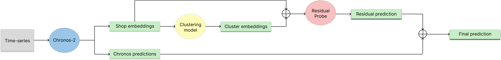

<p align="center">
  
</p>


# Zero-Shot Time Series Forecasting on Rossmann Sales Data using Chronos-2 Transformers

## 📌 Overview

The project investigates how well a large pre-trained time-series foundation model generalizes to retail sales forecasting without task-specific fine-tuning.

Beyond baseline zero-shot inference, the study explores systematic improvements through:

* Feature engineering
* Clustering-based store segmentation
* Identity-aware residual modeling

The goal is to analyze both the strengths and limitations of foundation models in structured retail forecasting tasks and to design hybrid strategies that enhance predictive performance.

### 🔎 Main Contributions

1. **Feature-Enhanced Zero-Shot Forecasting** – We improve baseline zero-shot inference by introducing cyclical seasonality encodings, administrative markers, and momentum/volatility signals to strengthen in-context learning.
2. **Store Regime Discovery via Clustering** – We identify latent subgroups of stores with similar operational dynamics using unsupervised clustering analysis.
3. **Identity-Aware Model Probing** – We propose a novel probing strategy that enables Chronos-2 to leverage information from stores with similar working regimes without fine-tuning model parameters. This process is illustrated in the figure below.

<p align="center">
  
</p>

---
## 📂 Project Structure

```bash
chronos-2-dnlp/
│
├── baseline/            # Baseline model implementation
├── data/                # Dataset and preprocessing scripts
├── evaluation/          # Evaluation metrics and testing scripts
├── extension1/          # First project extension
├── extension2/          # Second project extension
├── models/              # Model architectures and saved weights
├── notebooks/           # Jupyter notebooks summarizing key experiments and model evaluations
├── outputs/             # Predictions and generated outputs
├── reports/             # Summarized results for different settings used for evaluations
├── visualization/       # Data and result visualizations
├── config.py            # Project configuration file
├── requirements.txt     # Python dependencies
└── README.md            # Project documentation
```

## 🚀 Getting Started

## 🐍 Environment Requirements

* **Python version:** 3.10.x (required)

### Step 1: Clone the Repository

```bash
git clone https://github.com/iskoo-14/chronos-2-dnlp.git
cd chronos-2-dnlp
```

### Step 2: Install Dependencies

```bash
pip install -r requirements.txt
```

### Step 3: 

#### ▶ Run Baseline
```bash
python baseline/run_baseline.py
```

#### ▶ Run Extension 1
```bash
python extension1/run_extension1.py
```

#### ▶ Run Extension 2
```bash
python extension2/run_extension2.py
```


## 👥 Authors
This project was created by:

Ana Parovic (ana.parovic@studenti.polito.it)

Antonio Potenza (antonio.potenza@studenti.polito.it)

Era Alcani (era.alcani@studenti.polito.it)

Ismail Aljosevic (ismail.aljosevic@studenti.polito.it)

Nicoletta Toma (nicoletta.toma@studenti.polito.it)
